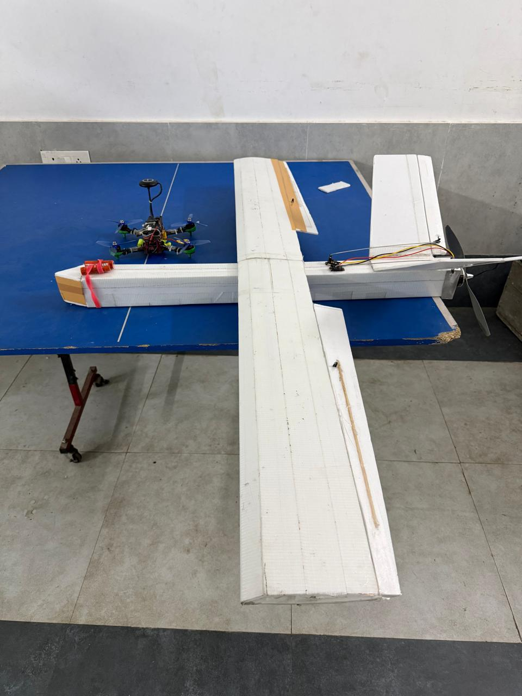

## Rectangular Wing V-Tail Pusher UAV | Project Documentation
### Aerospace Society, BIT Mesra

  

  <em>Figure 0.1 – Rectangular Wing V-Tail Pusher UAV prototype.</em>

---

## 1. Objective

The primary objective of this project is to design, manufacture, and validate a **Rectangular Wing V-Tail Pusher Unmanned Aerial Vehicle (UAV)** capable of stable, efficient, and controlled flight. The project integrates aerodynamics, aircraft stability, propulsion, structures, and avionics into a practical engineering system. It also provides hands-on experience in aircraft design, CAD modelling, fabrication, electronics integration, testing, and technical documentation.

## 2. Nature of the Build

| Attribute | Detail |
|---|---|
| Category | Fixed-Wing UAV |
| Configuration | Rectangular Wing with V-Tail and Rear-Mounted Pusher Propulsion |
| Mission | Research, Learning and Demonstration Platform |
| Control | Manual RC, with future autopilot compatibility |

## 3. Scope

- Configuration selection
- Aerodynamic design and stability analysis
- CAD modelling and structural design
- Material selection
- Propulsion and avionics integration
- CG calculations and performance estimation
- Fabrication, assembly, ground testing, glide testing, and flight testing

### Learning Outcomes
Aircraft design, CAD, aerodynamics, manufacturing, avionics, teamwork, documentation, and testing.

## 4. Team & Roles

The table below sets out the role structure defined for the project. Names and specific contributions (drawn from the authorship notes in the Design Report) are listed underneath each relevant role.

| Role | Responsibility |
|---|---|
| Project Lead | Planning, coordination, and mentor communication |
| CAD & Design | Aircraft modelling and engineering drawings |
| Aerodynamics | Wing sizing, V-tail design, and stability analysis |
| Structures | Material selection and fabrication |
| Avionics | Motor, ESC, battery, receiver, and electronics integration |
| Procurement | Vendor comparison and purchasing |
| Testing | Ground, glide, and flight testing |
| Documentation | Technical reports and project records |

### Mentors

| Name | Contribution |
|---|---|
| **Rajdeep Kumar** | Project mentorship and technical guidance |
| **Shreyanshu Ghosh** | Project mentorship and technical guidance |

### Team Aeronautics

| Name | Contribution |
|---|---|
| **Anurag Kumar** | Aeronautics team — aerodynamic design and stability analysis |
| **Rishabh Tiwari** | Authored the airfoil selection and aerodynamic characteristics analysis (Clark Y airfoil geometry, lift/moment behavior, Reynolds number sensitivity) |
| **Nikhil Kumar** | Aeronautics team — aerodynamic design and stability analysis |

### Team Avionics

| Name | Contribution |
|---|---|
| **Abhishek Kumar Singh** | Authored the propulsion and avionics architecture (motor, servo, ESC, propeller, and battery eliminator circuit selection and rationale); prepared the schematic circuit diagram |
| **Aadity Setu** | Co-authored the propulsion and avionics architecture section, including component selection rationale for the motor, ESC, and propeller system |

### Team CAD

| Name | Contribution |
|---|---|
| **Vasu Suneja** | Co-authored the CAD Model section — 2D sketch, dimensions, and performance calculations (stall speed, cruise speed, thrust-to-weight ratio, CG) |
| **Aarush Verma** | Co-authored the CAD Model section, including 3D modelling of the airframe |

## 5. Timeline

| Phase | Milestone |
|---|---|
| Project Announcement | Project introduced by AeroSoc mentors |
| Team Formation | Members grouped according to skills |
| Role Allocation | Responsibilities assigned |
| Literature Review | Research and concept study |
| Design & CAD | CAD models and calculations completed |
| Procurement | Components ordered |
| Fabrication | Airframe assembled |
| Electronics Integration | Avionics installed |
| Ground Testing | Control checks and CG verification |
| Glide Testing | Initial aerodynamic validation |
| Flight Testing | Powered flight evaluation |
| Documentation | Final report submission |

## 6. Success Criteria

- Successful completion of the UAV design.
- Airframe fabricated as per CAD model.
- Proper avionics integration.
- CG within safe limits.
- Successful glide and powered flight validation.